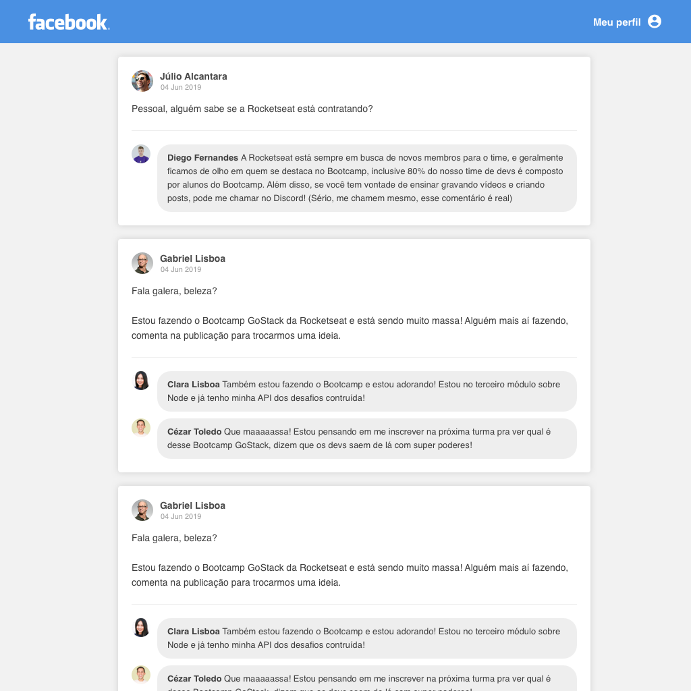

<h1 align="center">
    
</h1>

<h3 align="center">
  Desafio 4: Introdução ao React
</h3>

<blockquote align="center">“Sucesso não é o resultado de um jogo, mas o destino de uma jornada”!</blockquote>

## :rocket: Sobre o desafio

Crie uma aplicação do zero utilizando **Webpack, Babel, Webpack Dev Server e ReactJS**.

Nessa aplicação você irá desenvolver uma **interface** semelhante com a do **Facebook** utilizando React.

As informações contidas na interface são **estáticas** e não precisam refletir nenhuma API REST ou back-end.

### Tela da aplicação

O layout não precisa ficar exatamente igual, você pode utilizar sua criatividade para modificar da maneira que preferir.

O layout da aplicação está [nesse link](.github/layout.sketch) que pode ser aberto por essa ferramenta gratuita e online: https://www.figma.com/